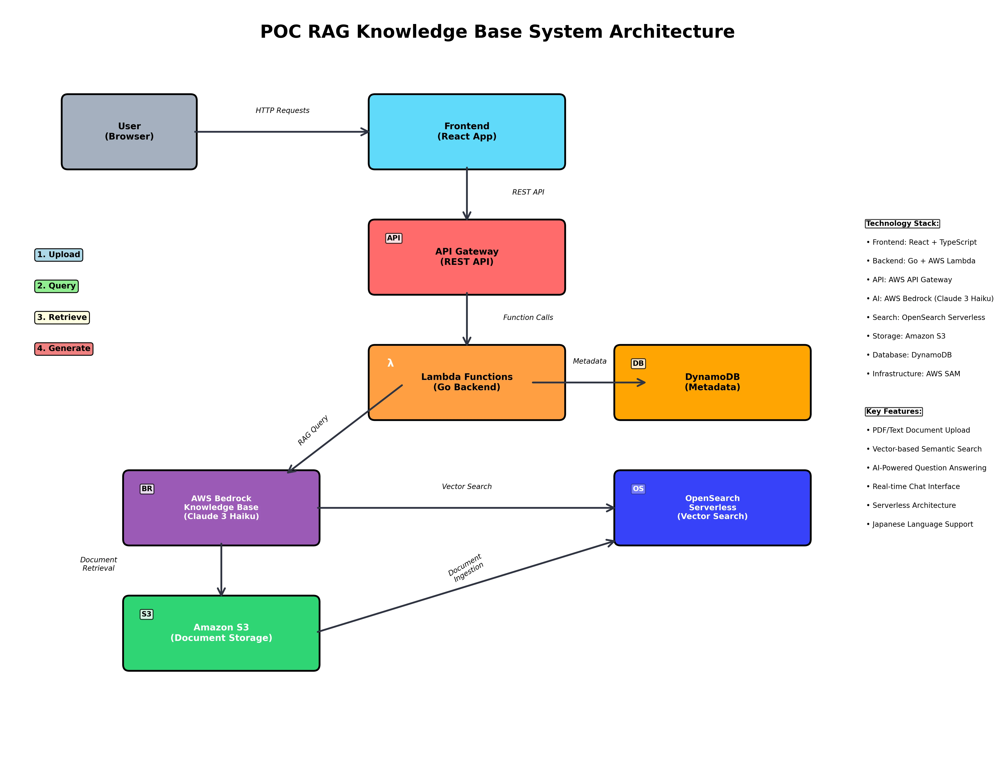
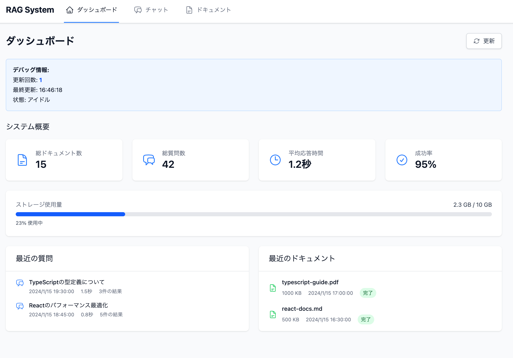
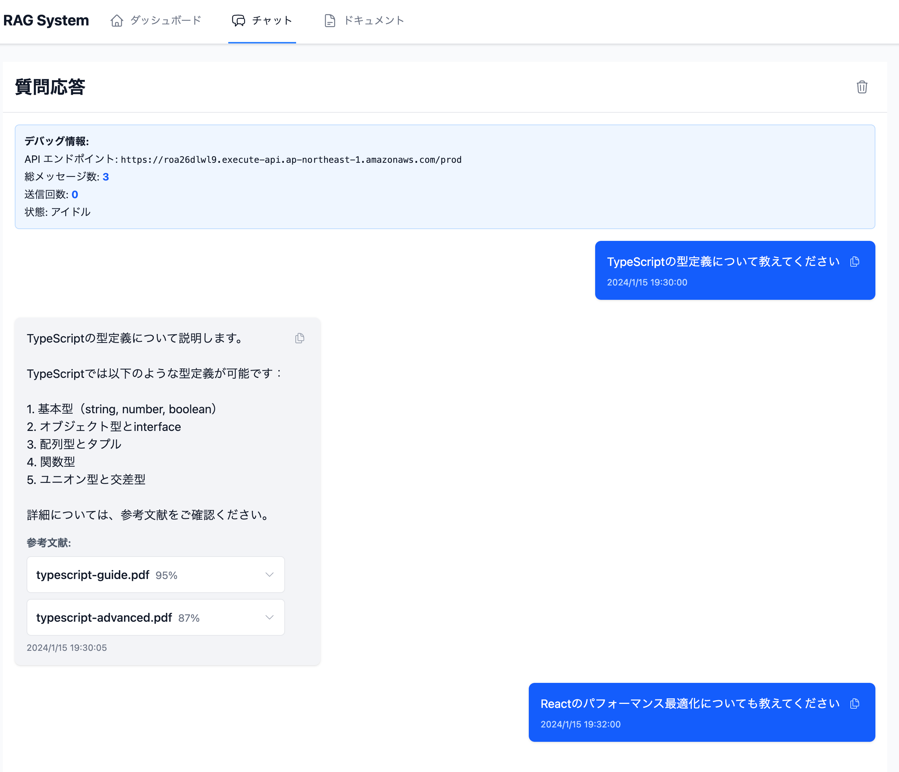
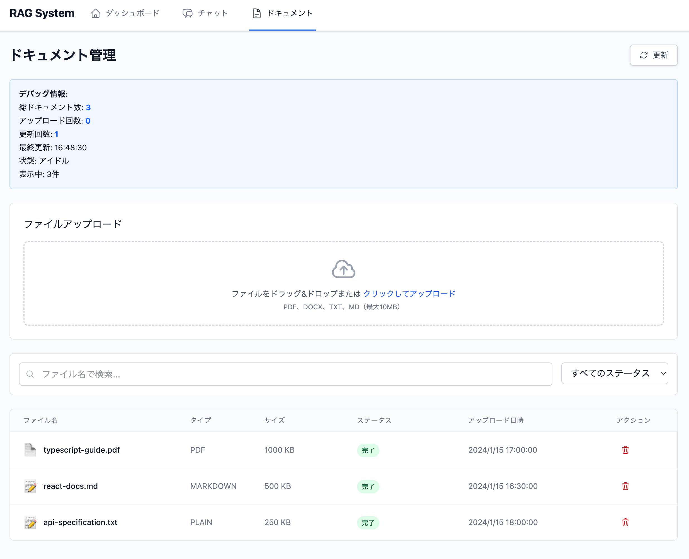

# POC RAG Knowledge Base システム

AWS BedrockとOpenSearchを使用したRAG（Retrieval-Augmented Generation）システムのProof of Conceptです。

## 概要

このシステムは以下の機能を提供します。

- 文書アップロード: PDFやテキストファイルをS3にアップロード
- 文書検索: OpenSearch Serverlessでベクトル検索
- AI回答生成: AWS Bedrock Claude 3 Haikuで自然言語回答
- チャットインターフェース: ReactベースのユーザーフレンドリーなUI




また、サブテーマとしてAIにドキュメントやコーディングします。使用したのは以下のツール類です。AIエージェントが作ったファイル類も参考としてリポジトリに格納しています。

- AWS Kiro: 要件や仕様をまとめる
- Claude Code: コーディングエージェント

## 実際の画面

実際の画面イメージは以下です。

### ダッシュボード



### チャット



### ドキュメント管理



## 前提条件

- AWS CLI (設定済み)
- AWS SAM CLI
- Go 1.21+
- Node.js 18+
- 必要なAWSサービスの権限
  - Amazon Bedrock
  - OpenSearch Serverless
  - Lambda
  - API Gateway
  - DynamoDB
  - S3

## アーキテクチャ

```
フロントエンド (React) → API Gateway → Lambda (Go) → Bedrock Knowledge Base → OpenSearch Serverless
                                          ↓
                                    DynamoDB (メタデータ)
                                          ↓
                                      S3 (文書保存)
```

## セットアップ手順

### 1. リポジトリのクローン

```bash
git clone <repository-url>
cd poc-ragbkb
```

### 2. OpenSearch Serverless コレクションの作成

以下を順番に実行します。

#### 2.1 OpenSearch Serverless コレクションの作成

```bash
# コレクション作成
aws opensearchserverless create-collection \
    --name "poc-ragbkb-knowledge" \
    --type VECTORSEARCH \
    --description "RAG Knowledge Base collection"
```

#### 2.2 セキュリティポリシーの作成

```bash
# データアクセスポリシー
aws opensearchserverless create-security-policy \
    --name "poc-ragbkb-data-policy" \
    --type data \
    --policy '[
        {
            "Rules": [
                {
                    "ResourceType": "index",
                    "Resource": [
                        "collection/poc-ragbkb-knowledge/*"
                    ],
                    "Permission": [
                        "aoss:CreateIndex",
                        "aoss:DeleteIndex",
                        "aoss:UpdateIndex",
                        "aoss:DescribeIndex",
                        "aoss:ReadDocument",
                        "aoss:WriteDocument"
                    ]
                },
                {
                    "ResourceType": "collection",
                    "Resource": [
                        "collection/poc-ragbkb-knowledge"
                    ],
                    "Permission": [
                        "aoss:CreateCollectionItems"
                    ]
                }
            ],
            "Principal": [
                "arn:aws:iam::<YOUR_ACCOUNT_ID>:user/<YOUR_USERNAME>",
                "arn:aws:iam::<YOUR_ACCOUNT_ID>:role/service-role/AmazonBedrockExecutionRoleForKnowledgeBase_*"
            ]
        }
    ]'

# ネットワークポリシー (パブリックアクセス)
aws opensearchserverless create-security-policy \
    --name "poc-ragbkb-network-policy" \
    --type network \
    --policy '[
        {
            "Rules": [
                {
                    "ResourceType": "collection",
                    "Resource": [
                        "collection/poc-ragbkb-knowledge"
                    ]
                },
                {
                    "ResourceType": "dashboard",
                    "Resource": [
                        "collection/poc-ragbkb-knowledge"
                    ]
                }
            ],
            "AllowFromPublic": true
        }
    ]'
```

#### 2.3 コレクションエンドポイントの確認

```bash
# コレクションの詳細を取得
aws opensearchserverless batch-get-collection --names "poc-ragbkb-knowledge"
```

エンドポイントURLをメモしてください（例: `https://xxxxx.ap-northeast-1.aoss.amazonaws.com`）

#### 2.4 重要：インデックス作成

OpenSearchコレクションが作成されただけでは、ベクトル検索用のインデックスは存在しません。
Knowledge Baseが正常に動作するために、事前に正しい設定でインデックスを作成する必要があります。

以下のスクリプトを使用してインデックスを作成します：

```bash
# インデックス作成用スクリプトの作成
cat > create_index.sh << 'EOF'
#!/bin/bash

# 設定
COLLECTION_ENDPOINT="https://xxxxx.ap-northeast-1.aoss.amazonaws.com"  # ← 実際のエンドポイントに変更
INDEX_NAME="bedrock-knowledge-base-default-index"
AWS_REGION="ap-northeast-1"

echo "OpenSearchインデックス作成開始..."

# インデックス作成
curl -X PUT \
  "${COLLECTION_ENDPOINT}/${INDEX_NAME}" \
  -H "Content-Type: application/json" \
  -H "Authorization: AWS4-HMAC-SHA256 $(aws sts get-caller-identity --query Account --output text)" \
  --aws-sigv4 "aws:amz:${AWS_REGION}:aoss" \
  -d '{
    "settings": {
      "index": {
        "knn": true
      }
    },
    "mappings": {
      "properties": {
        "bedrock-knowledge-base-default-vector": {
          "type": "knn_vector",
          "dimension": 1536,
          "method": {
            "name": "hnsw",
            "space_type": "cosinesimil",
            "engine": "faiss"
          }
        },
        "AMAZON_BEDROCK_METADATA": {
          "type": "text",
          "index": false
        },
        "AMAZON_BEDROCK_TEXT_CHUNK": {
          "type": "text"
        }
      }
    }
  }'

if [ $? -eq 0 ]; then
    echo "インデックス作成成功"
else
    echo "インデックス作成失敗"
    exit 1
fi

# インデックス確認
echo "インデックス確認中..."
curl -X GET "${COLLECTION_ENDPOINT}/${INDEX_NAME}" \
  --aws-sigv4 "aws:amz:${AWS_REGION}:aoss"

EOF

chmod +x create_index.sh
```

重要な設定説明：

- `dimension: 1536`: Amazon Titan Embedding モデルのベクトル次元数
- `bedrock-knowledge-base-default-vector`: ベクトルフィールド名（Bedrockのデフォルト）
- `AMAZON_BEDROCK_METADATA`, `AMAZON_BEDROCK_TEXT_CHUNK`: Bedrockが使用する標準フィールド

```bash
# インデックス作成実行
./create_index.sh
```

トラブルシューティング:

1. 401 Unauthorized: セキュリティポリシーを確認

### 3. Bedrock Knowledge Baseの作成

#### 3.1 サービスロールの作成

```bash
# Knowledge Base用のサービスロール作成
aws iam create-role \
    --role-name AmazonBedrockExecutionRoleForKnowledgeBase_poc \
    --assume-role-policy-document '{
        "Version": "2012-10-17",
        "Statement": [
            {
                "Effect": "Allow",
                "Principal": {
                    "Service": "bedrock.amazonaws.com"
                },
                "Action": "sts:AssumeRole"
            }
        ]
    }'

# 必要なポリシーをアタッチ
aws iam attach-role-policy \
    --role-name AmazonBedrockExecutionRoleForKnowledgeBase_poc \
    --policy-arn arn:aws:iam::aws:policy/AmazonBedrockFullAccess

# OpenSearch用のカスタムポリシー作成
aws iam create-policy \
    --policy-name BedrockOpenSearchPolicy \
    --policy-document '{
        "Version": "2012-10-17",
        "Statement": [
            {
                "Effect": "Allow",
                "Action": [
                    "aoss:APIAccessAll"
                ],
                "Resource": "*"
            }
        ]
    }'

# カスタムポリシーをアタッチ
aws iam attach-role-policy \
    --role-name AmazonBedrockExecutionRoleForKnowledgeBase_poc \
    --policy-arn arn:aws:iam::<YOUR_ACCOUNT_ID>:policy/BedrockOpenSearchPolicy
```

#### 3.2 Knowledge Baseの作成

```bash
# S3バケット作成（データソース用）
aws s3 mb s3://poc-ragbkb-knowledge-source-<UNIQUE_SUFFIX>

# Knowledge Base作成
aws bedrock-agent create-knowledge-base \
    --name "poc-ragbkb-kb" \
    --description "POC RAG Knowledge Base" \
    --role-arn "arn:aws:iam::<YOUR_ACCOUNT_ID>:role/AmazonBedrockExecutionRoleForKnowledgeBase_poc" \
    --knowledge-base-configuration '{
        "type": "VECTOR",
        "vectorKnowledgeBaseConfiguration": {
            "embeddingModelArn": "arn:aws:bedrock:ap-northeast-1::foundation-model/amazon.titan-embed-text-v1"
        }
    }' \
    --storage-configuration '{
        "type": "OPENSEARCH_SERVERLESS",
        "opensearchServerlessConfiguration": {
            "collectionArn": "arn:aws:aoss:ap-northeast-1:<YOUR_ACCOUNT_ID>:collection/<COLLECTION_ID>",
            "vectorIndexName": "bedrock-knowledge-base-default-index",
            "fieldMapping": {
                "vectorField": "bedrock-knowledge-base-default-vector",
                "textField": "AMAZON_BEDROCK_TEXT_CHUNK",
                "metadataField": "AMAZON_BEDROCK_METADATA"
            }
        }
    }'
```

#### 3.3 データソースの作成

```bash
# データソース作成
aws bedrock-agent create-data-source \
    --knowledge-base-id <KNOWLEDGE_BASE_ID> \
    --name "poc-ragbkb-datasource" \
    --description "S3 data source for POC RAG KB" \
    --data-source-configuration '{
        "type": "S3",
        "s3Configuration": {
            "bucketArn": "arn:aws:s3:::poc-ragbkb-knowledge-source-<UNIQUE_SUFFIX>",
            "inclusionPrefixes": ["documents/"]
        }
    }'
```

### 4. バックエンドのデプロイ

#### 4.1 設定の更新

`backend/template.yaml`で以下の値を更新してください：

```yaml
Parameters:
  KnowledgeBaseId:
    Type: String
    Description: Bedrock Knowledge Base ID
    Default: "<YOUR_KNOWLEDGE_BASE_ID>"  # ← 作成したKnowledge Base ID
  
  DataSourceId:
    Type: String
    Description: Bedrock Knowledge Base Data Source ID  
    Default: "<YOUR_DATA_SOURCE_ID>"     # ← 作成したData Source ID
```

#### 4.2 デプロイの実行

```bash
cd backend

# ビルドとデプロイ
sam build
sam deploy --guided

# 初回は対話形式で設定
# - Stack Name: poc-ragbkb-backend-prod
# - AWS Region: ap-northeast-1
# - 他はデフォルトまたは適切な値を入力
```

### 5. フロントエンドのセットアップ

```bash
cd frontend

# 依存関係のインストール
npm install

# 環境変数の設定
cp .env.example .env.local

# .env.localを編集
# REACT_APP_API_BASE_URL=https://your-api-gateway-url/prod
```

#### 5.1 開発サーバーの起動

```bash
npm run dev
```

#### 5.2 プロダクションビルド

```bash
npm run build

# デプロイ (例: S3 + CloudFront)
aws s3 sync dist/ s3://your-frontend-bucket/
```

## 動作確認

### 1. システムの動作確認

```bash
# ヘルスチェック
curl https://your-api-gateway-url/prod/health

# 文書のアップロード（APIテスト）
curl -X POST https://your-api-gateway-url/prod/documents \
  -H "Content-Type: application/json" \
  -d '{
    "fileName": "test.txt",
    "contentType": "text/plain"
  }'
```

### 2. Knowledge Baseのテスト

```bash
# データソースの同期（アップロードした文書がある場合）
aws bedrock-agent start-ingestion-job \
    --knowledge-base-id <YOUR_KB_ID> \
    --data-source-id <YOUR_DS_ID>

# 同期状況の確認
aws bedrock-agent get-ingestion-job \
    --knowledge-base-id <YOUR_KB_ID> \
    --data-source-id <YOUR_DS_ID> \
    --ingestion-job-id <JOB_ID>
```

## トラブルシューティング

### よくある問題と解決方法

#### 1. OpenSearchインデックスエラー
```
Error: Index not found or incompatible mapping
```
解決方法: インデックス作成手順を再度実行し、フィールドマッピングを確認

#### 2. Knowledge Base接続エラー
```
Error: Unable to connect to OpenSearch collection  
```
解決方法: 
- セキュリティポリシーでBedrockロールに権限付与
- コレクションエンドポイントの確認

#### 3. 文書取り込みエラー
```
Error: Ingestion job failed
```
解決方法:
- S3バケット権限の確認
- 文書形式の確認（PDF、TXT、DOCX対応）
- ファイルサイズの確認（50MB以下）

### デバッグ用コマンド

```bash
# Lambda ログの確認
aws logs describe-log-groups --log-group-name-prefix "/aws/lambda/poc-ragbkb"

# 最新のログイベントを取得
aws logs get-log-events \
  --log-group-name "/aws/lambda/poc-ragbkb-backend-prod-api-function" \
  --log-stream-name "<LOG_STREAM_NAME>"

# OpenSearchコレクションの状態確認
aws opensearchserverless batch-get-collection --names "poc-ragbkb-knowledge"

# Knowledge Base の状態確認  
aws bedrock-agent get-knowledge-base --knowledge-base-id <KB_ID>
```

## 設定ファイルサンプル

### backend/samconfig.toml (参考)
```toml
version = 0.1
[default]
[default.deploy]
[default.deploy.parameters]
stack_name = "poc-ragbkb-backend-prod"
s3_bucket = "aws-sam-cli-managed-default-samclisourcebucket-xxxxx"
s3_prefix = "poc-ragbkb-backend-prod"
region = "ap-northeast-1"
capabilities = "CAPABILITY_IAM"
parameter_overrides = "KnowledgeBaseId=XXXXX DataSourceId=YYYYY"
```
## コントリビューション

1. Issue の作成
2. Feature branch の作成
3. Pull Request の送信

## ライセンス

MIT License